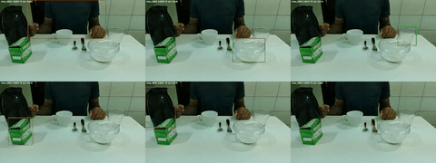

# Video Object Tracking with SAM2 + CoTracker

A video object tracking pipeline that combines **SAM2** (Segment Anything Model 2) and **CoTracker** to track objects across video frames using an initial bounding box annotation.

---

## Overview

Given a video and an initial bounding box for an object, this pipeline predicts the object's bounding box in every frame. It works by:

1. Using SAM2 to generate a pixel-level segmentation mask from the initial bounding box
2. Sampling anchor points from the mask
3. Tracking those points across all frames using CoTracker
4. Running SAM2 per-frame on tracked points to generate candidate boxes
5. Selecting the best box each frame using a multi-factor scoring function

---

## Requirements

### Dependencies

```
numpy
torch
matplotlib
Pillow
scipy
imageio
tqdm
```

### Models

- **SAM2** — [Segment Anything Model 2](https://github.com/facebookresearch/segment-anything-2)
  - Checkpoint: `sam2.1_hiera_large.pt`
  - Config: `sam2.1_hiera_l.yaml`
- **CoTracker** — [Co-Tracker](https://github.com/facebookresearch/co-tracker)
  - Checkpoint: `scaled_offline.pth`

### Installation

```bash
# Clone the repository
git clone https://github.com/yourusername/your-repo.git
cd your-repo

# Install dependencies
pip install torch torchvision numpy matplotlib pillow scipy imageio tqdm

# Install SAM2
pip install git+https://github.com/facebookresearch/segment-anything-2.git

# Install CoTracker
pip install git+https://github.com/facebookresearch/co-tracker.git
```

---

## Data Format

The script expects:
- **.mp4 Videos**
- **.json Annotations**

### Annotation JSON structure

```json
{
  "<subject_id>": [
    {
      "id": "annotation_id",
      "frame_ids": [0, 1, 2, ...],
      "bounding_boxes": [[x0_norm, y0_norm, x1_norm, y1_norm], ...]
    }
  ]
}
```

Bounding boxes are in normalized coordinates `[0, 1]`.

---

## Usage

```bash
python main.py --subject <subject_id> --split <split>
```

**Arguments:**
| Argument | Description | Example |
|---|---|---|
| `subject_id` | Video subject identifier | `subject_001` |
| `split` | Dataset split | `train`, `val`, or `test` |

**Example:**
```bash
python track.py subject_001 val
```

---

### Output format

```json
{
  "annotation_id": {
    "boxes": [[x0, y0, x1, y1], ...],
    "frames": [0, 1, 2, ...]
  }
}
```

Boxes are in pixel coordinates `[x0, y0, x1, y1]`.



---

## How It Works

### 1. Initial Segmentation
SAM2 segments the object in the first annotated frame using the provided bounding box. The mask is morphologically eroded to remove noisy boundary pixels.

### 2. Point Sampling
50 random points are sampled from within the eroded mask to serve as representative anchor points for the object.

### 3. Point Tracking
CoTracker tracks all 50 points through every frame of the video, outputting per-frame (x, y) positions and visibility scores.

### 4. Per-Frame Box Selection
For each frame:
- SAM2 generates a candidate segmentation mask and bounding box for each tracked point
- A scoring function (`choose_best_box`) selects the best box based on:
  - **IoU consensus** — agreement among candidate boxes
  - **Point coverage** — fraction of tracked points inside the box
  - **Interior margin** — how deeply points sit inside the box
  - **Center consistency** — proximity to the previous frame's box center
  - **Area consistency** — similarity in size to the previous frame's box

The weights between point-based evidence and temporal smoothness are dynamically adjusted based on how many points are visible in a given frame.

---

## Project Structure

```
.
├── track.py                  # Main tracking script
├── configs/
│   └── sam2.1/
│       └── sam2.1_hiera_l.yaml
└── README.md
```

---

## Citation

If you use this work, please cite:

**SAM2:**
```bibtex
@article{ravi2024sam2,
  title={SAM 2: Segment Anything in Images and Videos},
  author={Ravi, Nikhila et al.},
  journal={arXiv},
  year={2024}
}
```

**CoTracker:**
```bibtex
@article{karaev2023cotracker,
  title={CoTracker: It is Better to Track Together},
  author={Karaev, Nikita et al.},
  journal={arXiv},
  year={2023}
}
```

---

## License

This project is for research purposes as part of the ICCV challenge on infant head movement.
